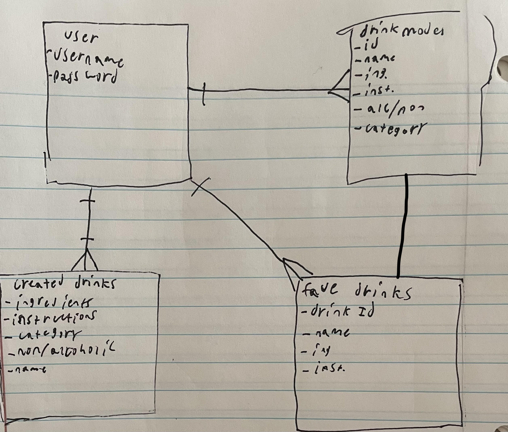

# Shanes-cocktail-app
--Using the [Cocktail API](https://www.thecocktaildb.com/api.php)--
# Technologies used
--This app will utilize CSS, JavaScript, node, mongoose, liquid and express--

# Installs
--npm i mongoose method-override express liquid liquid-express-views morgan dotenv bcrypt--

# Users Story
--an app designed to help you find the perfect drink for the perfect occasion--

---

1. The user will be greeted with a homescreen prompting them to log in or create an account
2. The user will be able to type in the navigate throught the navbar and find drinks related to their category
3. The user will be able to select different categories to look through, such as ingredients, alcoholic or non-alcoholic and categories of drink(cocktail, party drink, ordinary drink etc) and glasses used to serve the drink
4. The user will be able to save favorite drinks they like to a database 
5. The drink page will show all ingredients and relevant instructions to prepare the drink as well as providing an image of the drink
6. At the bottom of the page a random drink image will be displayed which when clicked will take the user to the drink show page
---

# Wireframes

--The home page where users will be able to see the search categories and the random drink img--

--The login/signup page--

--The drink show page, which displays all of the drink information, including ingredients, an image, and the instructions to create it--

--The search page where you choose a category to filter through and find a frink to add to your saved drink. Each category will take you to a new page which will then redirect you to your search results--

--When loading into the home page a random image of a random cocktail and click it to redirect to that drinks show page--

--The users will see their saved drinks displayed and will be able to delete their choices from the list--

--The users will be able to create a new drink in the create a drink page--

--The ERD showing the relationships between models and the user--
